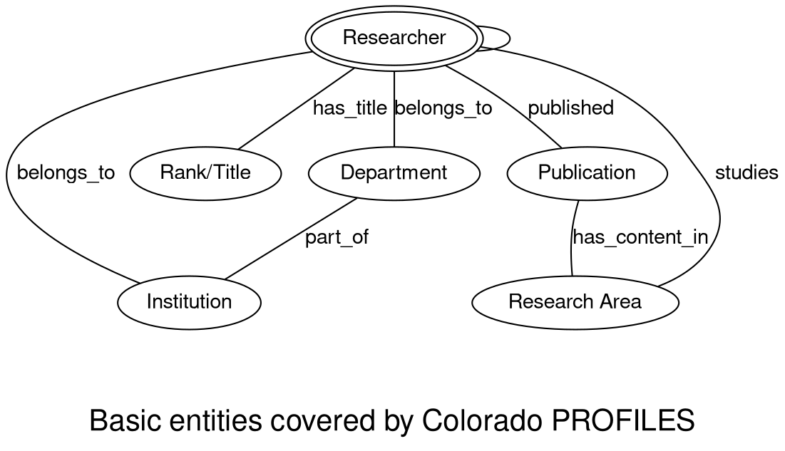

# Background

The [Colorado PROFILES search engine](https://profiles.ucdenver.edu/Search/Default.aspx) for biomedical research expertise and networking provides tools to help investigators and students find experts, potential collaborators or mentors, and to view past and present research networking of our investigators.

The system consists of a set of web pages that catalog information about researchers, their publications, research topics, and the relationships between them. 



## What is the goal of this project?

The Colorado PROFILES website does not include any bulk download capability or a programmatically accessible application programming interface (API). The goal of this project is to generate bulk datasets ready for social network analysis, reporting, dashboard generation, and for further enrichment and integration with other resources.

## What does this project produce?

This project employs web scraping to produce tables of:

1. all researchers in the Colorado PROFILES system along with their affiliations and titles.
2. all publications registered for each researcher
3. relations between researchers and research area (given by [MeSH terms](https://www.nlm.nih.gov/mesh/meshhome.html)) quantified by a score (higher score indicates closer association between author and research area)
4. derived relationships between authors as measured by MeSH term similarities

See details below. 

## Installation

The package requires python 3.9 or greater. 

```python
python -m pip install git@https://github.com/seandavi/cu_profile_utils
```

## Usage

```python
python -m cu_profile_utils.pipeline
```

A network connection and ~4GB of RAM are needed. The build process will proceed to scrape all records, requiring >20,000 web requests (current as of November, 2022). A set of csv files representing the output will be created in the current working directory. 

## Output files

### `profile_table.csv`


| Column name | Type | Description |
|----|----|----|
| name  | string | The researcher name |
| institution | string | The University of Colorado Campus to which the researcher belongs. |
| department | string | The researcher's primary department |
| title | string | The title or rank of the researcher |
| profile_id | integer | The Colorado PROFILES researcher id number |

### `profile_pmids.csv`

| Column name | Type | Description |
|----|----|----|
| profile_id | integer | The Colorado PROFILES researcher id number |
| pmid | integer | The Pubmed ID of the paper written by the researcher represented by the profile_id |

### `profile_mesh_sims.csv`

| Column name | Type | Description |
|----|----|----|
| profile_id | integer | The Colorado PROFILES researcher id number |
| mesh_term | string | The preferred MeSH term as a string |
| publication_count | integer | The total number of publications by the researcher with this profile_id |
| most_recent_publication_year | integer | The latest year that this author published a paper with this MeSH term |
| publication_count_all_authors | integer | The total number of papers in the Colorado PROFILES system with this MeSH term |
| concept_score | float | A (unitless) score representing the extent to which this author is associated with this MeSH term (or concept) |


